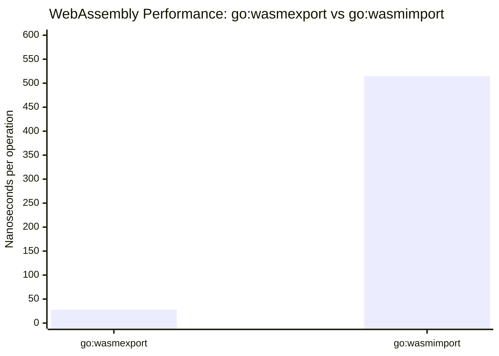

# WebAssembly Import vs Export Performance Comparison

This repository demonstrates the performance difference between two approaches for WebAssembly (WASM) module communication in Go using the [Wazero](https://wazero.io/) runtime and the standard Go compiler:

1. **go:wasmexport** - Direct function exports from WASM module
2. **go:wasmimport** - Host function imports with channel-based communication

## Results

Benchmark results show a significant performance difference:

```
goos: darwin
goarch: arm64
cpu: Apple M4 Max
BenchmarkAdd-14 (exported)    43554006    27.97 ns/op
BenchmarkAdd-14 (imported)     2390948   514.6 ns/op
```



## Implementation Details

### Exported Approach ([`exported/`](./exported))

The **exported** approach uses `go:wasmexport` to directly expose functions from the WASM module:

- **WASM Module** (`exported/module/module.go`):
  ```go
  //go:wasmexport add
  func add(a, b int32) int32 {
      return a + b
  }
  ```

- **Host Application** (`exported/main.go`):
  - Instantiates the WASM module using Wazero
  - Directly calls the exported `add` function
  - Simple, straightforward function calls

### Imported Approach ([`imported/`](./imported))

The **imported** approach uses `go:wasmimport` with a more complex communication pattern:

- **WASM Module** (`imported/module/module.go`):
  ```go
  //go:wasmimport conduit add_request
  func _addRequest(*int32, *int32)

  //go:wasmimport conduit add_response  
  func _addResponse(int32)
  ```
  - Runs in an infinite loop requesting work and sending responses
  - Uses host-provided functions for communication

- **Host Application** (`imported/main.go`):
  - Implements a "conduit" host module with request/response functions
  - Uses Go channels for communication between host and WASM
  - Runs WASM module in a separate goroutine
  - More complex setup with wazergo for host module definition

## Usage

### Build WASM modules:
```bash
make wasm
```

### Run benchmarks:
```bash
make bench
```

### Run examples:
```bash
# Run exported example
cd exported && go run .

# Run imported example  
cd imported && go run .
```
