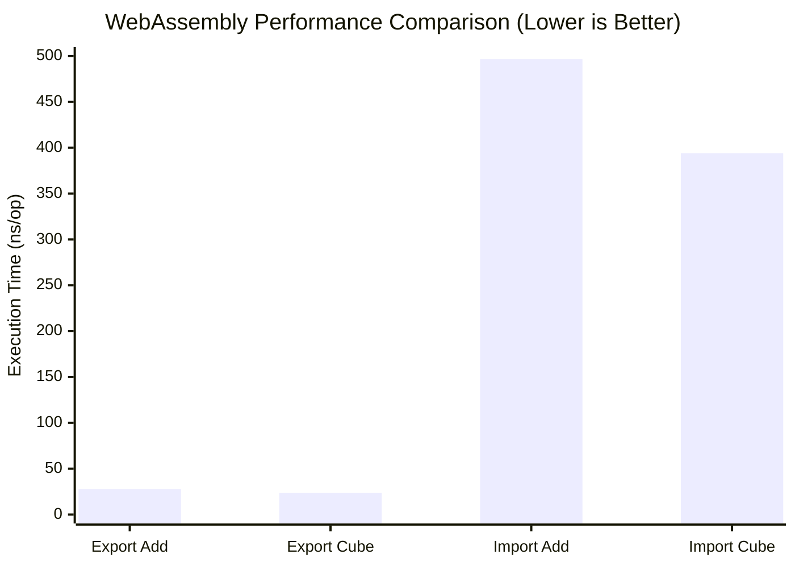

# WebAssembly Import vs Export Performance Comparison

This repository demonstrates the performance difference between two approaches for WebAssembly (WASM) module communication in Go using the [Wazero](https://wazero.io/) runtime:

1. **go:wasmexport** - Direct function exports from WASM module
2. **go:wasmimport** - Host function imports with channel-based communication

## Results

Benchmark results show a significant performance difference between the two approaches:

- **Exported approach**: ~24-28 ns/op (both add and cube)
- **Imported approach**: ~394-497 ns/op (cube vs add)
- **Performance difference**: ~14-18x slower for the imported approach

```
goos: darwin
goarch: arm64
cpu: Apple M4 Max

# Exported approach (direct function calls)
BenchmarkAdd-14     42218277    27.79 ns/op
BenchmarkCube-14    48552772    23.83 ns/op

# Imported approach (channel-based communication)
BenchmarkAdd-14      2399071   496.7 ns/op   # imported/add
BenchmarkCube-14     3056000   394.0 ns/op   # imported/cube
```



## Implementation Details

### Exported Approach ([`exported/`](./exported))

The **exported** approach uses `go:wasmexport` to directly expose functions from the WASM module:

- **WASM Module** (`exported/module/module.go`):
  ```go
  //go:wasmexport add
  func add(a, b int32) int32 {
      return a + b
  }

  //go:wasmexport cube
  func cube(a int32) int32 {
      return a * a * a
  }
  ```

- **Host Application** (`exported/main.go`):
  - Instantiates the WASM module using Wazero
  - Directly calls the exported `add` and `cube` functions
  - Simple, straightforward function calls

### Imported Approach ([`imported/`](./imported))

The **imported** approach uses `go:wasmimport` with a more complex communication pattern, split into two separate examples:

#### Add Function ([`imported/add/`](./imported/add))

- **WASM Module** (`imported/add/module/module.go`):
  ```go
  //go:wasmimport conduit add_request
  func _addRequest(*int32, *int32)

  //go:wasmimport conduit add_response  
  func _addResponse(int32)
  ```
  - Runs in an infinite loop requesting work and sending responses
  - Uses host-provided functions for communication

- **Host Application** (`imported/add/main.go`):
  - Implements a "conduit" host module with request/response functions
  - Uses Go channels for communication between host and WASM
  - Runs WASM module in a separate goroutine

#### Cube Function ([`imported/cube/`](./imported/cube))

- **WASM Module** (`imported/cube/module/module.go`):
  ```go
  //go:wasmimport conduit cube_request
  func _cubeRequest() int32

  //go:wasmimport conduit cube_response
  func _cubeResponse(int32)
  ```
  - Similar pattern to add but with a single parameter
  - Demonstrates the pattern with different function signatures

- **Host Application** (`imported/cube/main.go`):
  - Similar to the add example but adapted for single-parameter cube function
  - Uses typed channels (`chan int32`) instead of tuple channels

## Usage

### Build WASM modules:
```bash
make wasm
```

### Run benchmarks:
```bash
make bench
```

### Run examples:
```bash
# Run exported example (demonstrates both add and cube functions)
cd exported && go run .

# Run imported add example
cd imported/add && go run .

# Run imported cube example
cd imported/cube && go run .
```